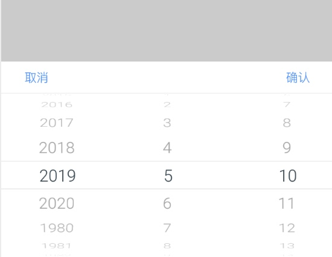

# 日期(滚轮)选择器控件
><font color=gray size=3>效果图</font>


##### 初始化对象和回调
```java
private DateWheelPicker picker = new DateWheelPicker() {
    @Override
    public void onDateOptionChange(DateSelectedItem selectedItem) {
        //选择日期后回调
    }
};
```
##### 显示日期窗口
```java
/**
 * 设置默认显示日期
 *
 * @param year  年
 * @param month 月
 * @param day   日
 */
public void setDefaultDate(int year, int month, int day)

/**
 * 设置默认显示日期
 *
 * @param timeMillis 毫秒时间截
 */
public void setDefaultDate(long timeMillis)

/**
 * 显示日期窗口
 *
 * @param context 上下文
 */
public void show(Context context)
```