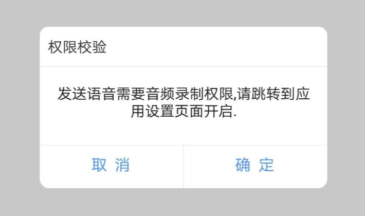

# Message Dialog
><font color=gray size=3>效果图</font>



><font color=gray size=3>创建并添加回调</font>

```java
private BaseMessageBox messageBox = new BaseMessageBox() {
    @Override
    public boolean onItemClickListener(View v, MsgBoxClickButtonEnum mcbenum, 
    String target, Object extraData) {
        //v:当前点击按钮的视图
        //target:区分不同业务的回调
        //mcbenum:判断点击的是哪个按钮
        //extraData:显示弹窗时传过来的额外参数
        return true;
    }
    
    //如果显示弹窗时创建自定义按钮需要使用以下回调方式
    @Override
    public boolean onItemClickListener(View v, String cmdid, 
    String target, Object extraData) {
        //v:当前点击按钮的视图
        //cmdid:按钮唯一标识
        //target:区分不同业务的回调
        //extraData:显示弹窗时传过来的额外参数
        return true;
    }
};
```
><font color=gray size=3>属性与显示弹窗</font>

```java
//右上角是否显示关闭按钮
messageBox.setShowClose(false);
//显示标题栏
messageBox.setShowTitle(true);
//设置标题
messageBox.setTitle("权限校验");
//弹窗内容(也可以通过messageBox.setContentView(view)设置)
messageBox.setContent("发送语音需要音频录制权限,请跳转到应用设置页面开启.");
//弹窗内容对齐方式(只对文本有效)
messageBox.setContentGravity(Gravity.CENTER);
//对应回调中的target
messageBox.setTarget("record_audio_permission");
//显示弹窗并设置按钮
messageBox.show(getContext(), DialogButtonsEnum.ConfirmCancel);

//如果是自定义按钮请用以下方式设置
CmdItem[] cmds = {
        new CmdItem("confirm", "确定"),
        new CmdItem("cancel", "取消")
};
messageBox.setButtons(cmds);
messageBox.show(getContext(), DialogButtonsEnum.Custom);
```
><font color=gray size=3>其它属性</font>

```java
//设置点击窗口之外区域是否关闭弹窗
messageBox.setCancelable(true/false);
//设置标题栏对齐方式
messageBox.setTitleGravity(Gravity.LEFT);
```