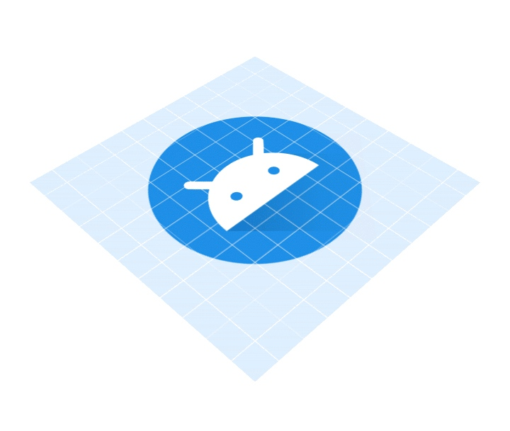
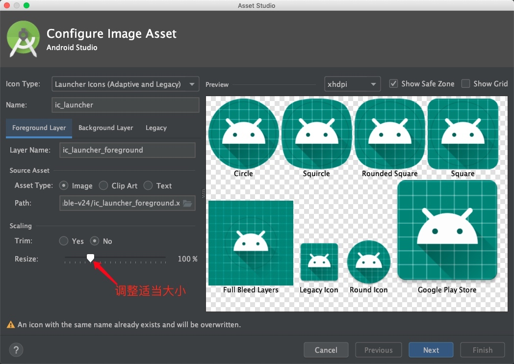

# Android AppIcon兼容各机型
><font color=gray size=3>
8.0之前sdk version<26启动图标
<font size=1>app icon各尺寸生成工具:mac可以用App Icon Gear,也可以使用在线地址https://icon.wuruihong.com</font>
</font>

* <font color=red>设计提供以下各尺寸无透明边距的图标(如果用工具生成只提供一张1024x1024即可);</font>

1. 小于v26分辨率与尺寸</br>
<font size=2>L DPI ( Low Density Screen，120 DPI )，其图标大小为 36 x 36 px</font></br>
<font size=2>M DPI ( Medium Density Screen, 160 DPI )，其图标大小为 48 x 48 px</font></br>
<font size=2>H DPI ( High Density Screen, 240 DPI )，其图标大小为 72 x 72 px</font></br>
<font size=2>XH DPI ( Extra-high density screen, 320 DPI )，其图标大小为 96 x 96 px</font></br>
<font size=2>XXH DPI( xx-high density screen, 480 DPI )，其图标大小为144 x 144 px</font></br>
<font size=2>XXXH DPI( xxx-high density screen, 640 DPI )，其图标大小为192 x 192 px </font></br>
2. 从api>=17开始新增mipmap,与drawable目录区别
参考链接:[<font color=#1515D1>官网mipmap与drawable区别</font>](https://www.jianshu.com/p/3b984405ad66)
根据[<font color=#1515D1>mipmap纹理及缩放特性</font>](https://www.jianshu.com/p/65376d181323)除对app启动图放在mipmap外，若对其它图片速度和显示要求比较高的(如app tab icon,...)也可放在mipmap下;

><font color=gray size=3>
8.0之后sdk version>=26启动图标适配
<font size=2>下图为图标组成形式:</font>
</font>



* 图标周边为纯色适配
    * <font color=red>
    设计提供以下图片资源即可,其它由Android Studio导入时自动生成:
        * 一张背景透明图标;
        * 一张192x192无图标背景图片;
    </font>
    * 图标生成步骤:
    1.用Android Studio打开项目右击res目录,选择『New』->『Image Asset』;
    2.调整与设置属性:(如下图,之后一直Next最后Finish即可)
    　Icon Type:图标生成类型选择Launcher Icons (Adaptive and Legacy)
    　Name:图标在项目中的名字;(自定义跟项目中原有图标名字保持一致即可)
    　Foreground Layer:在Path中选择背景透明的图标，然后根据Resize来调整图标大小保持在Show Safe Zone显示的范围内即可;
    　Background Layer:在Path无图标背景图片然后适当调整大小;

* 图标周边带有字体适配
    * <font color=red>
    设计提供一张192x192无透明边距原始图标即可,其它由Android Studio导入时自动生成;
    </font>
    * 图标生成步骤:
    
        ><font color=gray size=2>
        该类图标对于不同尺寸得分别导出:
        1.调整Resize尽量符合Full Bleed Layers大小导出后放在mipmap-xxxhdpi文件夹下;对于v26+引用的是mipmap-anydpi-v26下图标,该目录下引用图片名字与mipmap-xxxhdpi下图片名字对应即可;
        2.调整Resize尽量符合Legacy Icon和Google Play Store尺寸导出后放在mipmap-[hdpi,mdpi,xhdpi,xxhdpi]文件夹下;[名称与上面保持一致]
        3.调整Resize尽量符合Circle和Round Icon导出后将各文件夹下的ic_launcher_round.png分别做替换;[适配部分机型启动图为圆形的图标]
        </font>
        
        *<font color=#555555>生成过程中各属性设置与图标周边为纯色适配类似</font>*
* APP图标设置(for applicaton)
    ```xml
    <application
        <!--适配圆角图标-->
        android:icon="@mipmap/ic_launcher"
        <!--适配圆形图标-->
        android:roundIcon="@mipmap/ic_launcher_round">
        ...
    </application>
    ```